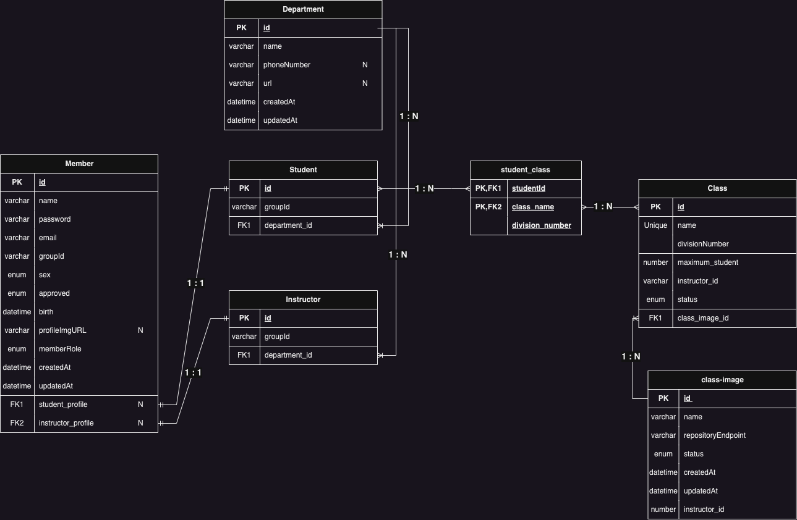

<p align="center">
  <a href="http://nestjs.com/" target="blank"></a>
</p>

[circleci-image]: https://img.shields.io/circleci/build/github/nestjs/nest/master?token=abc123def456
[circleci-url]: https://circleci.com/gh/nestjs/nest

  <p align="center">A progressive <a href="http://nodejs.org" target="_blank">Node.js</a> framework for building efficient and scalable server-side applications.</p>
  <!--[](https://opencollective.com/nest#backer)
  [](https://opencollective.com/nest#sponsor)-->

## Description

Cloud Education Backend Member Management API

## Used Stack

- TypeScript
- Nest.js
- MySQL
  - ORM : TypeORM
- MongoDB
- Redis
- Docker, Docker-Compose

## Coverage

94.77%

## Execution

### Development Environment

```
cd dev-docer

docker-compose up -d
```

### Production Environment

```
cd production-docker

docker-compose up -d
```

## ERD


